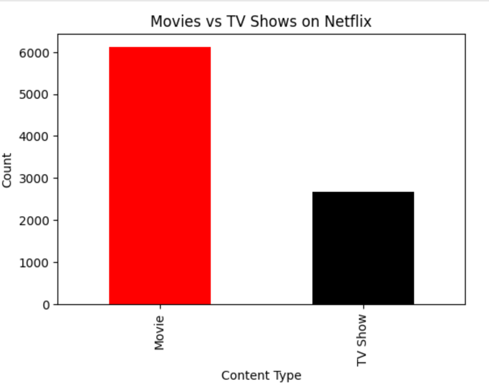
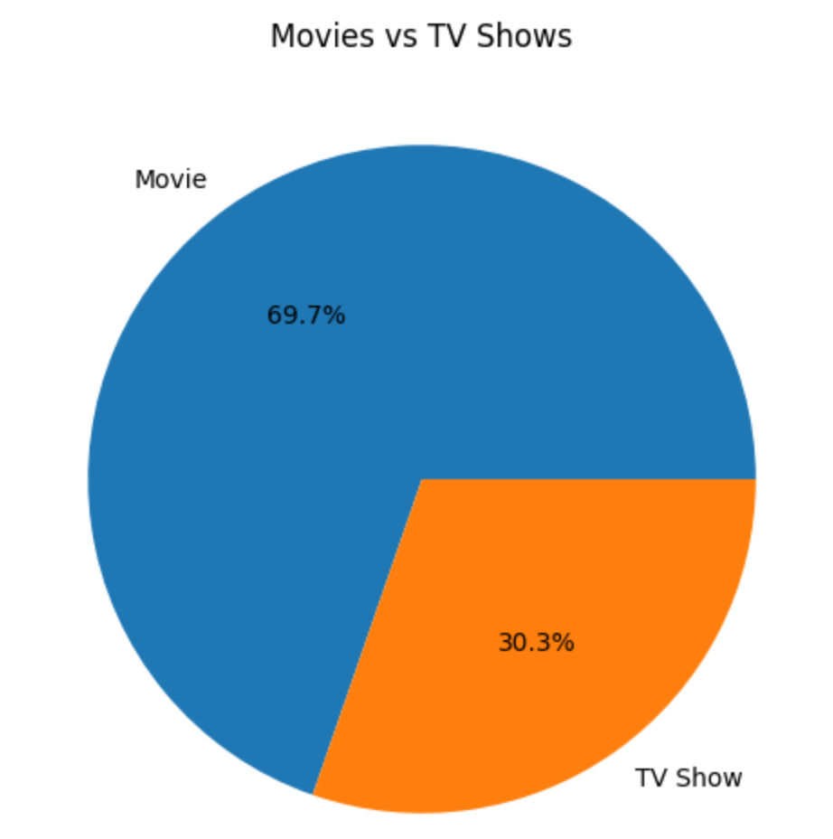
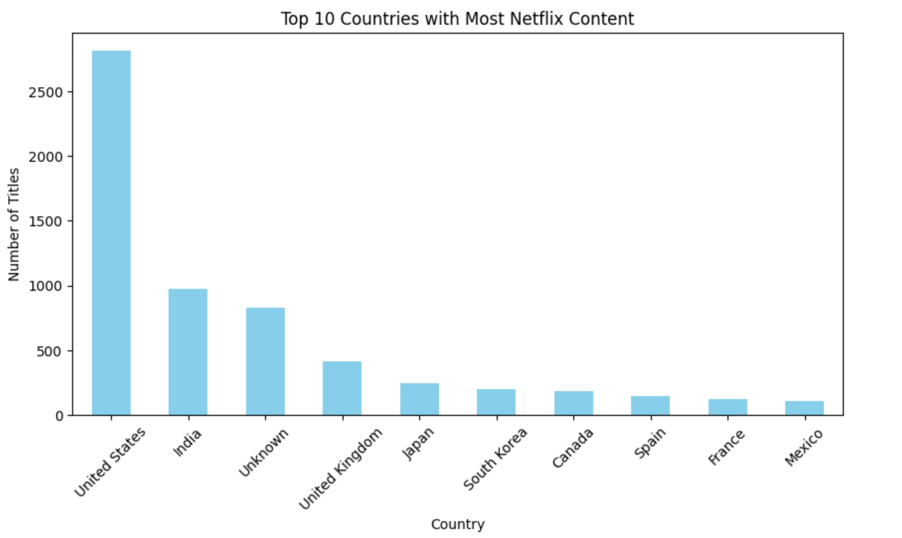
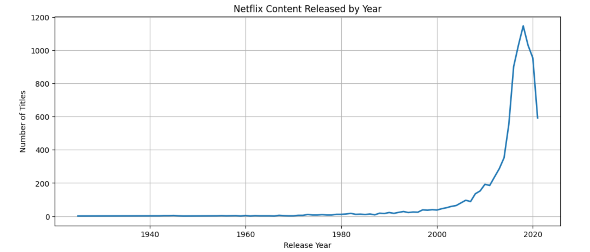
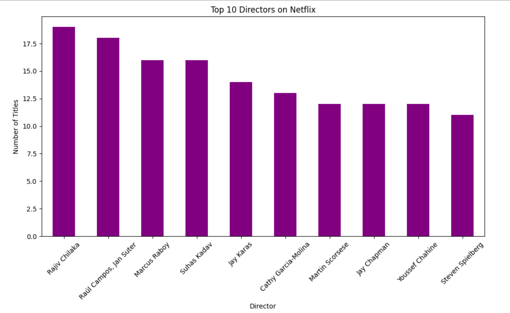

# 🎬 Netflix Data Analysis using Python

## Project Overview
This project analyzes the Netflix Movies and TV Shows dataset using Python to identify trends in content, release years, countries, directors, and genres.

## Technologies Used
- Python
- Pandas
- NumPy
- Matplotlib
- Jupyter Notebook

## Dataset
Netflix Movies and TV Shows Dataset

## Analysis Performed
- Data Cleaning
- Missing Value Handling
- Duplicate Removal
- Exploratory Data Analysis (EDA)
- Data Visualization

## Key Insights
- Netflix has more Movies than TV Shows.
- The United States contributes the highest number of Netflix titles.
- Most content was released between 2017 and 2021.
- Drama and International Movies are among the most common genres.
- Rajiv Chilaka has the highest number of titles among directors.

## Repository Files
- `netflix_analysis.ipynb`
- `netflix_titles.csv` 
## Visualizations

### Movies vs TV Shows (Bar Chart)

### Movies vs TV Shows (Pie Chart)

### Top 10 Countries

### Netflix Content Released by Year

### Top 10 Directors

## Conclusion

This project demonstrates data cleaning, exploratory data analysis (EDA), and data visualization using Python, Pandas, NumPy, and Matplotlib. The analysis identifies trends in Netflix content based on content type, release year, country, and directors.
